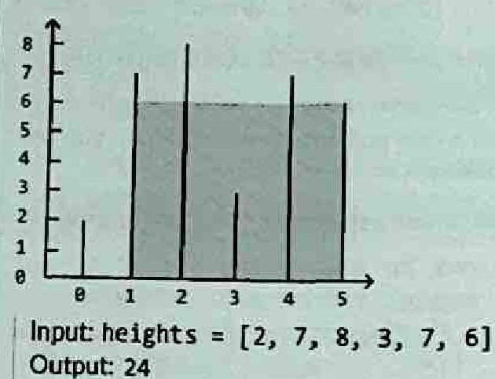
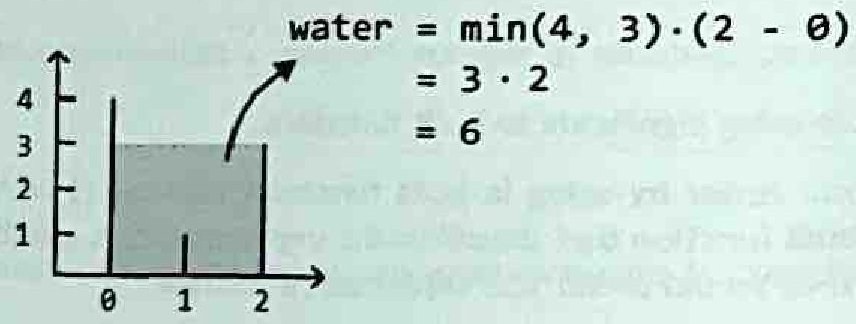

# Largest Container

> Time Limit: N/A
> Space Limit: N/A
> Difficulty: Medium
> Link: [LeetCode 11 – Container With Most Water](https://leetcode.com/problems/container-with-most-water/)

## Description

You're given an array of integers where each value represents the height of a vertical line drawn at that position. Any two lines, along with the x-axis, form a container. Find the pair of lines that holds the most water and return that volume.



**Example**:

```
Input:  height = [2, 3, 4, 2, 4, 1, 3]
Output: 15
// Lines at index 1 (height 3) and index 6 (height 3): min(3,3) × 5 = 15
```

**Input Format**:
An integer array `height` where `height[i]` is the height of the line at index `i`.

**Output Format**:
A single integer — the maximum water any container formed by two lines can hold.

**Constraints**:
- $2 \leq n \leq 10^5$
- $0 \leq \text{height}[i] \leq 10^4$

**Code Template**:
```java
public int maxArea(int[] height) {
    // your code here
}
```

**Hint**: Start with the widest possible container (first and last lines). At each step, move the pointer at the shorter line inward — moving the taller one can never improve the area.

## Solution

<details>
<summary>Click to view the solution</summary>

**Code**:
```java
public int maxArea(int[] height) {
    int maxWater = 0;
    int left = 0, right = height.length - 1;

    while (left < right) {
        // Calculate water for the current pair of lines
        int water = Math.min(height[left], height[right]) * (right - left);
        maxWater = Math.max(maxWater, water);

        // Move the pointer at the shorter line inward.
        // If both are equal, move both inward.
        if (height[left] < height[right]) {
            left++;
        } else if (height[left] > height[right]) {
            right--;
        } else {
            left++;
            right--;
        }
    }

    return maxWater;
}
```

The three-way branch can collapse into two:

```java
public int maxArea(int[] height) {
    int maxWater = 0;
    int left = 0, right = height.length - 1;

    while (left < right) {
        int water = Math.min(height[left], height[right]) * (right - left);
        maxWater = Math.max(maxWater, water);

        if (height[left] <= height[right]) {
            left++;
        } else {
            right--;
        }
    }

    return maxWater;
}
```

> When both heights are equal, advancing either pointer is valid. Any pair that uses the current shorter (equal) line with a closer neighbor will have less width while the height cap stays the same — so the area can only be worse. Folding the equal case into `left <= right` removes the extra branch without affecting correctness. The intent becomes: always move the pointer that cannot increase the height cap.

**Approach**: Two Pointers (Inward Traversal, Greedy)

**Intuition**: Water volume depends on width (distance between lines) and height (the shorter of the two). Starting from both ends gives the maximum possible width. Width can only shrink as pointers move inward, so any improvement must come from height. The critical question is which pointer to move. Moving the taller line inward loses width while keeping the height cap exactly the same — a guaranteed loss. Moving the shorter line at least gives a chance of finding a taller wall that compensates. So we always move the pointer at the shorter line.



**Mathematical/Other Foundation**:

For any two lines at indices $i$ and $j$ with $i<j$, the water they hold is:

$$\text{water}(i,j)=\min(\text{height}[i],\,\text{height}[j])\times(j-i)$$

The algorithm is correct because it never eliminates the optimal pair. Suppose the optimal pair is $(i^*, j^*)$. At any point where $\text{left}\leq i^*$ and $\text{right}\geq j^*$, assume $\text{height}[\text{left}]\leq\text{height}[\text{right}]$, so we move `left` forward. For any index $k$ with $\text{left}<k\leq j^*$, consider the pair $(\text{left}, k)$:

$$\text{water}(\text{left}, k)=\min(\text{height}[\text{left}],\text{height}[k])\times(k-\text{left})\leq\text{height}[\text{left}]\times(k-\text{left})$$

Since $k\leq j^*<\text{right}$, the width $k-\text{left}<\text{right}-\text{left}$, and the height cap is at most $\text{height}[\text{left}]$. Every pair $(\text{left},\cdot)$ is therefore worse than or equal to the current container. So `left` is not $i^*$ and advancing it is safe. The symmetric argument applies when the right line is shorter.

Each iteration moves at least one pointer inward. The two pointers start $n-1$ positions apart and must meet, so at most $n-1$ iterations run.

**Algorithm**:
1. Set `left = 0`, `right = height.length - 1`, `maxWater = 0`.
2. While `left < right`:
   - Compute `water = min(height[left], height[right]) × (right - left)`.
   - Update `maxWater = max(maxWater, water)`.
   - If `height[left] < height[right]`, increment `left`.
   - If `height[left] > height[right]`, decrement `right`.
   - If equal, increment `left` and decrement `right`.
3. Return `maxWater`.

**Complexity**:
- Time: $O(n)$ — each iteration moves at least one pointer inward; combined, the two pointers traverse at most $n-1$ positions.
- Space: $O(1)$ — three variables (`left`, `right`, `maxWater`); no auxiliary data structures.

**Test Cases**:

| Input | Output | Notes |
|-------|--------|-------|
| `height=[]` | `0` | Empty array |
| `height=[1]` | `0` | Single line — no container possible |
| `height=[0,1,0]` | `0` | Zero-height lines hold nothing |
| `height=[3,3,3,3]` | `9` | All equal: best is indices 0 and 3, $\min(3,3)\times3=9$ |
| `height=[1,2,3]` | `2` | Strictly increasing |
| `height=[3,2,1]` | `2` | Strictly decreasing |

**Pro Tips**:
- The greedy argument is what interviewers want to hear. Practice the one-sentence version: "Moving the taller pointer inward loses width while the height cap stays the same, so it can never improve the area." That's the full justification.
- This problem looks like it might need dynamic programming at first — you're optimizing over two variables simultaneously. The key observation that collapses it to a greedy scan is that width strictly decreases with each step, so we only have one dimension left to optimize.
- The brute force is $O(n^2)$ and worth mentioning before the optimal solution. It shows you understand the search space and makes the two-pointer improvement feel earned rather than pulled from memory.
</details>

## Solutions Link

- [[JAVA] Two Pointers (Inward Traversal, Greedy)](solutions/_04_LargestContainer_Solution01.java)

