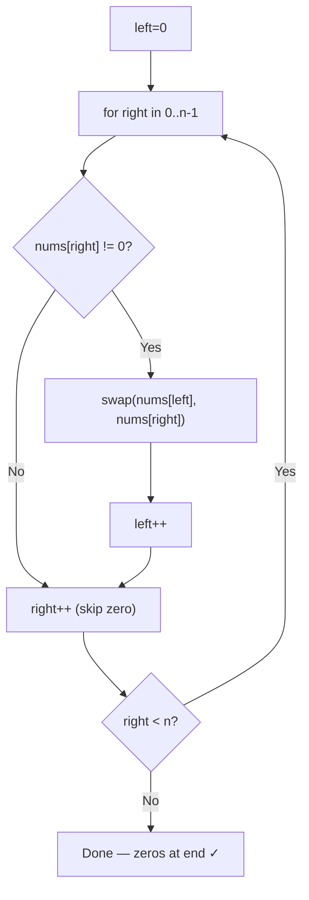

# Shift Zeros to the End

> Time Limit: N/A
> Space Limit: N/A
> Difficulty: Easy
> Link: [LeetCode 283 – Move Zeroes](https://leetcode.com/problems/move-zeroes/)

## Description

You're given an integer array. Rearrange it in place so all zeros are at the end while the non-zero elements stay in their original relative order.

**Example**:

```
Input:  nums = [0, 1, 0, 3, 2]
Output: [1, 3, 2, 0, 0]
```

**Input Format**:
An integer array `nums` that may contain zeros and non-zero integers.

**Output Format**:
No return value — modify `nums` in place. All zeros trail the non-zero elements, which retain their original order.

**Constraints**:
- Modification must be in place — no extra array
- Relative order of non-zero elements must be preserved
- $1 \leq n \leq 10^4$

**Code Template**:
```java
class Solution {
    public void moveZeroes(int[] nums) {
        // your code here
    }
}
```

**Hint**: Instead of pushing zeros right, pull non-zeros left. Use a `left` pointer to track the next open slot and a `right` pointer to scan for non-zeros.

## Solution

<details>
<summary>Click to view the solution</summary>

**Code**:
```java
class Solution {
    public void moveZeroes(int[] nums) {
        // 'left' marks the next insertion point for non-zero elements
        int left = 0;

        // 'right' scans the array looking for non-zero elements
        for (int right = 0; right < nums.length; right++) {
            if (nums[right] != 0) {
                // Swap the non-zero element into the 'left' position
                int temp = nums[left];
                nums[left] = nums[right];
                nums[right] = temp;

                // Advance 'left' -- this slot is now filled with a non-zero
                left++;
            }
        }
    }
}
```

**Approach**: Two Pointers (Unidirectional)

**Intuition**: The naive solution copies non-zero elements into a temp array and writes them back — correct, but it uses $O(n)$ extra space. The insight that unlocks the in-place version is a perspective shift: instead of thinking "move zeros right," think "move non-zeros left." Zeros end up at the tail automatically. Two pointers let you do this in a single pass: `left` tracks the next open slot, and `right` scans ahead for non-zero values. When `right` finds one, swap it into `left` and advance both. The boundary between processed non-zeros and trailing zeros sits right at `left`.

$$[\ 0,\ 1,\ 0,\ 2,\ 3\ ] \longrightarrow [\ 1,\ 2,\ 3,\ 0,\ 0\ ]$$

$$\underbrace{\quad\quad\quad\quad}_{\text{non-zero elements go here}}$$

**Mathematical/Other Foundation**:

After $k$ swaps, `left == k`. The loop invariant is: at the start of each iteration, `nums[0..left-1]` contains all non-zero elements seen so far, in their original order.

When `right` finishes, `left` equals the total number of non-zero elements. All positions from `left` to $n-1$ hold zeros — not because they were placed there explicitly, but because each swap moved a zero from position `left` to wherever `right` found a non-zero. Since non-zeros accumulate at the front and zeros drift toward the tail, the result is correct by the invariant.

**Algorithm**:
1. Set `left = 0`.
2. For `right` from `0` to `n-1`:
   - If `nums[right] != 0`: swap `nums[left]` and `nums[right]`, then increment `left`.
   - Otherwise skip — `right` advances, `left` stays.
3. Array is modified in place.



**Complexity**:
- Time: $O(n)$ — `right` traverses the array exactly once; `left` advances at most $n$ times total.
- Space: $O(1)$ — only two index variables and a swap temp; no auxiliary array.

**Test Cases**:

| Input | Output | Notes |
|-------|--------|-------|
| `nums=[]` | `[]` | Empty array |
| `nums=[0]` | `[0]` | Single zero |
| `nums=[1]` | `[1]` | Single non-zero |
| `nums=[0,0,0]` | `[0,0,0]` | All zeros |
| `nums=[1,3,2]` | `[1,3,2]` | No zeros — array unchanged |
| `nums=[1,1,1,0,0]` | `[1,1,1,0,0]` | Zeros already at end |
| `nums=[0,0,1,1,1]` | `[1,1,1,0,0]` | All zeros at start |

**Pro Tips**:
- The `left` pointer is a write cursor. After the loop, `left` equals the count of non-zero elements — everything from `left` to the end is guaranteed zero.
- When `left == right` (no zeros have appeared yet), the swap is a no-op. It's harmless and keeps the code clean. Adding a branch to skip it rarely helps in practice.
</details>

## Solutions Link

- [[JAVA] Two Pointers (Unidirectional)](solutions/_05_ShiftZerosToTheEnd_Solution01.java)
