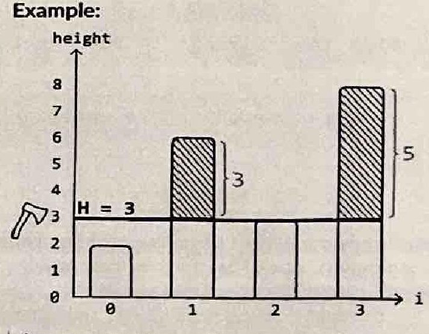
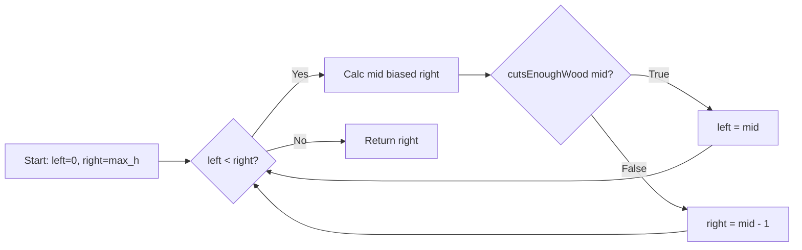

# Cutting Wood

> Time Limit: 1s
> Space Limit: 256 MB
> Link: [https://www.spoj.com/problems/EKO/](https://www.spoj.com/problems/EKO/)

## Description

You are given an array of tree heights and a target amount of wood $k$. You need to set a blade height $H$ for your woodcutter. The machine cuts the top off every tree taller than $H$. You want to find the maximum integer height $H$ that allows you to cut at least $k$ meters of wood.

**Example**:

Input: heights = [2,6,3,8], k = 7
Output: 3



Setting the blade height to 3 cuts the trees of height 6 and 8 down to size. The wood collected is $(6-3) + (8-3) = 8$ meters, which satisfies the requirement of at least 7. Any higher setting would yield less wood.

**Constraints**:
- It is guaranteed that at least $k$ meters of wood can be collected.
- There is at least one tree.

**Code Template**:
```java
import java.util.*;

public class Solution {
    public int cuttingWood(int[] heights, int k) {
        // Implementation goes here
    }
}
```

**Hint**: The amount of wood collected decreases monotonically as the blade height increases. Try applying binary search to the range of possible heights rather than the array indices.

## Solution

<details>
<summary>Click to view the solution</summary>

**Code**:
```java
import java.util.*;

public class Solution {
    public int cuttingWood(int[] heights, int k) {
        // The search space is between 0 and the tallest tree.
        int left = 0;
        int right = 0;
        for (int h : heights) {
            right = Math.max(right, h);
        }

        // We are looking for the upper bound (last true value).
        while (left < right) {
            // Bias mid to the right to avoid infinite loops.
            // Standard mid calculation might get stuck on (left + right) / 2 when left and right are adjacent.
            int mid = left + (right - left) / 2 + 1;

            if (cutsEnoughWood(heights, mid, k)) {
                // If we cut enough wood, we can try a higher setting.
                // We include mid because it's a valid candidate.
                left = mid;
            } else {
                // If we don't cut enough, the setting is too high.
                // We exclude mid.
                right = mid - 1;
            }
        }

        return right;
    }

    // Helper method to check if a specific height 'H' yields at least 'k' wood.
    private boolean cutsEnoughWood(int[] heights, int H, int k) {
        long woodCollected = 0;
        for (int h : heights) {
            if (h > H) {
                woodCollected += (h - H);
            }
            // Optimization: break early if we've already collected enough.
            if (woodCollected >= k) {
                return true;
            }
        }
        return woodCollected >= k;
    }
}
```

**Approach**: Upper-bound Binary Search.

**Intuition**:
This problem is a classic application of binary search on the answer space. At first glance, binary search seems wrong because the input array is not sorted. However, if we look at the possible heights for the blade setting $H$, we see a sorted range of integers from $0$ to $\text{max}(\text{heights})$.

More importantly, there is a monotonic property involved. If we set the blade very low (close to 0), we cut a lot of wood. As we raise the blade, the amount of wood collected decreases. This creates a sequence of boolean outcomes (true for "cuts enough", false for "doesn't cut enough") that looks like `[True, True, True, False, False]`. This sorted sequence of boolean values is perfect for binary search. We just need to find the last `True` in that sequence.

**Mathematical/Other Foundation**:
Let $W(H)$ be the total wood collected at height setting $H$.
$$W(H) = \sum_{h_i > H} (h_i - H)$$
We want to find the maximum $H$ such that $W(H) \ge k$.
The function $W(H)$ is non-increasing. That is, for any $H_1 < H_2$, $W(H_1) \ge W(H_2)$.
This monotonicity guarantees that if $H$ is a valid height, all heights lower than $H$ are also valid. This validates our use of binary search to find the transition point (upper bound).

**Algorithm**:
1.  Define the search range. The lowest possible setting is $0$. The highest is the maximum height in the input array.
2.  Perform an upper-bound binary search.
    *   Calculate `mid` biased to the right: `mid = left + (right - left) / 2 + 1`. This is crucial to prevent infinite loops when `left` and `right` are adjacent.
    *   Check if `cutsEnoughWood(mid)` returns `true`.
    *   If `true`, the answer is at `mid` or to the right. Set `left = mid`.
    *   If `false`, the answer must be to the left. Set `right = mid - 1`.
3.  When `left` meets `right`, we have found the maximum valid height. Return `right`.

**Visualizations**:


**Complexity**:
- Time: $O(N \log M)$, where $N$ is the number of trees and $M$ is the maximum tree height. The binary search takes $O(\log M)$ steps, and each step involves an $O(N)$ iteration to calculate the wood sum.
- Space: $O(1)$, as we only use a few variables for state.

**Test Cases**:

| Input | Output | Notes |
|-------|--------|-------|
| heights=[2,6,3,8], k=7 | 3 | Standard case from the problem description. |
| heights=[4,4,4], k=3 | 3 | All trees same height. Cuts exactly 3. |
| heights=[10, 20], k=1 | 19 | Cuts 1 meter from the tall tree. |
| heights=[5], k=5 | 0 | Must cut the entire tree. |

**Pro Tips**:
- Be careful with integer overflow. The sum of wood collected can exceed the range of a 32-bit integer. It is safer to accumulate the sum in a `long`.
- When finding an upper bound with binary search, standard midpoint calculation `mid = (left + right) / 2` can cause an infinite loop if `left = mid` is the update logic. Always bias the midpoint to the right using `mid = left + (right - left) / 2 + 1`.
</details>

## Solutions Link

- [[JAVA] Upper-bound Binary Search.](solutions/_05_CuttingWood_Solution01.java)
