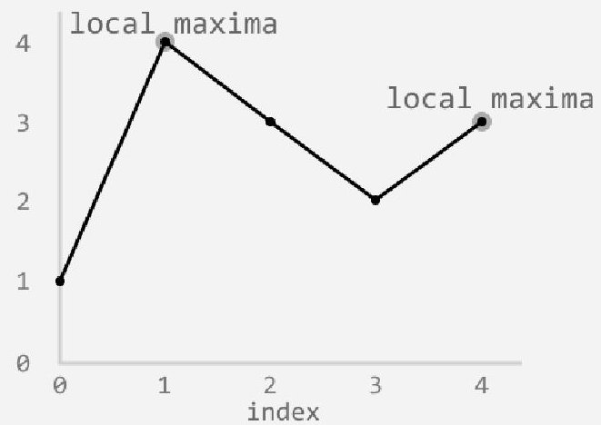
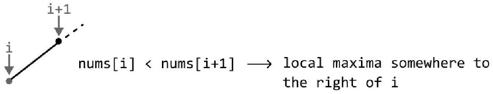
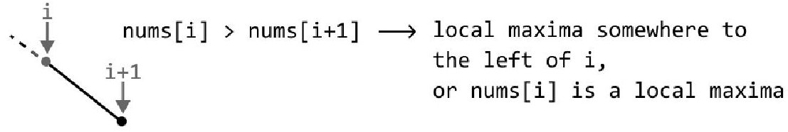

# Local Maxima in Array

> Time Limit: 1s
> Space Limit: 256 MB
> Link: [https://leetcode.com/problems/find-peak-element/](https://leetcode.com/problems/find-peak-element/)

## Description

You need to find the index of any local maxima in an array. A local maxima is an element strictly greater than its immediate neighbors. For elements at the boundaries of the array, assume the neighbor outside the array is smaller. The array is guaranteed to have no adjacent duplicates.

**Example**:
Input: nums = [1,4,3,2,3,1]
Output: 1 (or 4 is also acceptable)



Explanation: Index 1 (value 4) is a peak because it is greater than its neighbors 1 and 3. Index 4 (value 3) is also a peak because it is greater than 2 and 1. You may return either index.

**Constraints**:
- $1 \le \text{nums.length} \le 1000$
- $-2^{31} \le \text{nums[i]} \le 2^{31} - 1$
- $\text{nums[i]} \neq \text{nums[i+1]}$ for all valid $i$.

**Code Template**:
```java
class Solution {
    public int findPeakElement(int[] nums) {
        // Implementation goes here
    }
}
```

**Hint**: The array represents a series of slopes. If you are on an ascending slope, a peak must exist to your right.

## Solution

<details>
<summary>Click to view the solution</summary>

**Code**:
```java
class Solution {
    public int findPeakElement(int[] nums) {
        int left = 0;
        int right = nums.length - 1;

        while (left < right) {
            int mid = left + (right - left) / 2;
            
            // Check the slope direction by comparing mid with its right neighbor.
            // Since left < right, mid + 1 is always a valid index.
            if (nums[mid] > nums[mid + 1]) {
                // We are on a descending slope.
                // The peak is at mid or somewhere to the left.
                right = mid;
            } else {
                // We are on an ascending slope.
                // The peak must be strictly to the right of mid.
                left = mid + 1;
            }
        }
        
        // When left == right, we have converged on a peak.
        return left;
    }
}
```

**Approach**: Binary Search on the slope direction.

**Intuition**:
A linear scan works, but we can do better. The key insight is that the array consists of connected slopes. Since there are no adjacent duplicates, we are always either going up or down. If we pick a random point and see that the next number is larger, we are on an ascending slope. Logic dictates that we must eventually reach a peak if we continue ascending. This means a peak definitely exists to the right. Conversely, if the next number is smaller, we are on a descending slope, meaning a peak exists at or to the left of the current position. This ability to discard half the search space based on the "slope" suggests a binary search approach.


The opposite applies if points i and i+1 form a descending slope.


**Mathematical/Other Foundation**:
Let $f(i) = \text{nums}[i]$. A local maxima is an index $i$ such that $f(i-1) < f(i) > f(i+1)$.
We exploit the property that for any index $i$, if $f(i) < f(i+1)$, there exists a peak in the range $[i+1, \text{high}]$. If $f(i) > f(i+1)$, there exists a peak in the range $[\text{low}, i]$.
This monotonicity in the slope direction allows binary search convergence.

**Algorithm**:
1. Initialize `left` to 0 and `right` to `nums.length - 1`.
2. Loop while `left < right`.
3. Calculate `mid`. We do not need to worry about overflow for standard constraints, but `left + (right - left) / 2` is a safe habit.
4. Compare `nums[mid]` with `nums[mid + 1]`.
5. If `nums[mid] > nums[mid + 1]`, we are on a downward slope. The peak is at `mid` or to the left. Set `right = mid`.
6. If `nums[mid] < nums[mid + 1]`, we are on an upward slope. The peak is to the right. Set `left = mid + 1`.
7. When the loop terminates, `left` equals `right`, which is the peak index.

**Complexity**:
- Time: $O(\log n)$, where $n$ is the length of the array. We divide the search space in half at each step.
- Space: $O(1)$, as we only use pointers for the search.

**Test Cases**:

| Input | Output | Notes |
|-------|--------|-------|
| [1, 2, 3, 1] | 2 | Single peak in the middle. |
| [1, 2, 1, 3, 5, 6, 4] | 1 or 5 | Multiple peaks allowed. |
| [1] | 0 | Single element is always a peak. |
| [1, 2] | 1 | Peak at the end. |

**Pro Tips**:
- This approach only works because the problem guarantees no adjacent duplicates. If duplicates were allowed, we couldn't determine the slope direction with a simple comparison, and we might need to handle flat regions.
- Note that we compare `mid` with `mid + 1`. This is safe because the loop condition `left < right` ensures that `mid` will never be the last element of the current search range, so `mid + 1` is always valid.
</details>

## Solutions Link

- [[JAVA] Binary Search on the slope direction.](solutions/_06_LocalMaximaInArray_Solution01.java)
