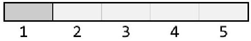

# Weighted Random Selection

> Time Limit: 1s
> Space Limit: 256 MB
> Link: [https://leetcode.com/problems/random-pick-with-weight/](https://leetcode.com/problems/random-pick-with-weight/)

## Description

You are given an array of positive integers called `weights`. You need to implement a class that picks an index from this array randomly. The probability of picking a specific index should be proportional to its weight. Specifically, the probability of picking index $i$ is $\frac{weights[i]}{\sum weights}$.

**Example**:
Input: `weights = [3, 1, 2, 4]`
Output: The function `pickIndex()` should return index 0 with 30% probability, index 1 with 10% probability, index 2 with 20% probability, and index 3 with 40% probability.

**Constraints**:
- $1 \le \text{weights.length} \le 10^4$
- $1 \le \text{weights[i]} \le 10^5$
- `pickIndex` will be called at most $10^4$ times.

**Code Template**:
```java
class Solution {
    public Solution(int[] w) {
        
    }
    
    public int pickIndex() {
        
    }
}
```

**Hint**: Convert the weights into a cumulative sum array to represent segments on a number line, then use binary search to map a random number to an index.

## Solution

<details>
<summary>Click to view the solution</summary>

**Code**:
```java
// Stage 1: Direct Translation
import java.util.Random;

class Solution {
    private int[] prefixSums;
    private Random random;

    public Solution(int[] weights) {
        this.random = new Random();
        this.prefixSums = new int[weights.length];
        // Build the prefix sum array
        prefixSums[0] = weights[0];
        for (int i = 1; i < weights.length; i++) {
            prefixSums[i] = prefixSums[i - 1] + weights[i];
        }
    }

    public int pickIndex() {
        // Total sum is the last element in prefixSums
        int totalSum = prefixSums[prefixSums.length - 1];
        // Generate a random target between 1 and totalSum (inclusive)
        int target = random.nextInt(totalSum) + 1;

        // Binary search for the lower bound
        int left = 0;
        int right = prefixSums.length - 1;

        while (left < right) {
            int mid = left + (right - left) / 2;
            if (prefixSums[mid] < target) {
                left = mid + 1;
            } else {
                right = mid;
            }
        }
        return left;
    }
}
```

```java
// Stage 2: Optimized
import java.util.Random;
import java.util.concurrent.ThreadLocalRandom;

class Solution {
    private int[] prefixSums;
    private int totalSum;

    public Solution(int[] weights) {
        this.prefixSums = new int[weights.length];
        int sum = 0;
        for (int i = 0; i < weights.length; i++) {
            sum += weights[i];
            prefixSums[i] = sum;
        }
        this.totalSum = sum;
    }

    public int pickIndex() {
        // ThreadLocalRandom is often more efficient and cleaner than creating a Random instance
        // nextInt(origin, bound) returns a value in [origin, bound), so we use (1, totalSum + 1)
        int target = ThreadLocalRandom.current().nextInt(1, totalSum + 1);

        // Standard binary search for the insertion point
        int left = 0;
        int right = prefixSums.length - 1;

        while (left < right) {
            int mid = left + (right - left) / 2;
            // If mid is strictly less than target, the answer must be to the right
            if (prefixSums[mid] < target) {
                left = mid + 1;
            } else {
                // If mid is equal or greater, it is a potential answer
                right = mid;
            }
        }
        return left;
    }
}
```

> The Stage 2 solution uses `ThreadLocalRandom`, which is generally preferred in modern Java for concurrent environments and avoids the overhead of allocating a `Random` object manually. It also caches the `totalSum` to avoid accessing the array length repeatedly.

**Approach**: Prefix Sum + Binary Search.

**Intuition**:
The problem asks us to pick an index based on its weight. Think of the weights as line segments placed end-to-end. If weights are $[3, 1, 2]$, we draw a line of length 6. The first 3 units belong to index 0, the next 1 unit to index 1, and the last 2 units to index 2.

If we throw a dart randomly at this line (pick a random number between 1 and 6), the probability of hitting a specific segment is exactly proportional to its length. The only task remaining is finding out which segment contains our random point. Since the boundaries of these segments are defined by a cumulative sum (prefix sum), and prefix sums are sorted, we can efficiently locate the segment using binary search.



**Mathematical/Other Foundation**:
We define the cumulative distribution function (CDF) for the indices. Let $W = \sum_{k=0}^{n-1} w_k$.
The probability of selecting index $i$ is $P(i) = \frac{w_i}{W}$.
We precompute an array $S$ where $S[i] = \sum_{k=0}^{i} w_k$.
To select an index, we pick a uniform random variable $T \in [1, W]$.
We find the smallest index $i$ such that $S[i] \ge T$. This is a lower-bound search.

**Algorithm**:
1.  **Preprocessing**: In the constructor, iterate through the input `weights` and build a `prefixSums` array. `prefixSums[i]` holds the sum of weights from index 0 to $i$.
2.  **Selection**:
    *   Generate a random integer `target` between 1 and the maximum prefix sum (total weight).
    *   Perform a binary search on `prefixSums` to find the first index `i` where `prefixSums[i] >= target`.
    *   Return this index `i`.

**Complexity**:
- Time: The constructor takes $O(n)$ time to compute prefix sums. The `pickIndex` method takes $O(\log n)$ time due to binary search.
- Space: $O(n)$ to store the prefix sums array.

**Test Cases**:

| Input | Operation | Notes |
|-------|-----------|-------|
| `weights = [1]` | `pickIndex()` | Always returns 0. |
| `weights = [1, 3]` | `pickIndex()` | Returns 0 approx 25% of time, 1 approx 75%. |
| `weights = [100, 1]` | `pickIndex()` | Heavily biased towards index 0. |

**Pro Tips**:
- Be careful with 1-based indexing vs 0-based indexing. The random target is usually generated in the range $[1, \text{total}]$, but if you generate in $[0, \text{total}-1]$, you simply adjust the binary search condition to find the first prefix sum strictly greater than the target.
- If the sum of weights is very large, consider if the integer type needs to be `long` to prevent overflow during the prefix sum calculation. The constraints here fit in an integer.
</details>

## Solutions Link

- [[JAVA] Prefix Sum + Binary Search.](solutions/_08_WeightedRandomSelection_Solution01.java)
